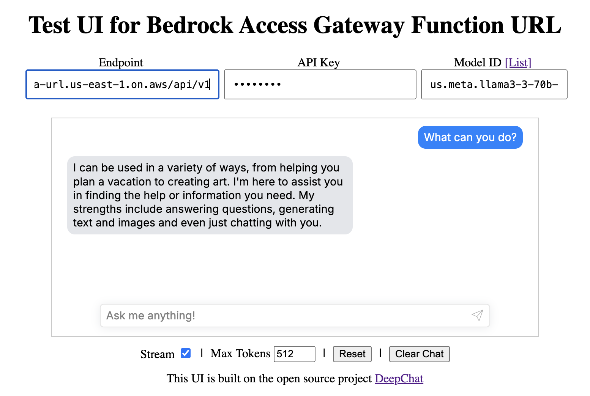

# bedrock-access-gateway-function-url

# Why not XXX?

<table>
  <thead>
    <tr>
      <th>Solution</th>
      <th>Pros &amp; Cons</th>
    </tr>
  </thead>
  <tbody>
    <tr>
      <td><strong>LiteLLM</strong> (Python SDK)</td>
      <td>
        (-) <a href="https://github.com/BerriAI/litellm/blob/d77b825814c354935ac540c8f8b4b696f23d83c9/pyproject.toml#L21-L61">full list of unnecessary dependencies</a> potentially bloating your Python environment/application, e.g., <code>gunicorn</code>, <code>fastapi</code>, <code>google-cloud-kms</code>, etc.<br>
        (-) Python Only
      </td>
    </tr>
    <tr>
      <td><strong>LiteLLM</strong> (Proxy)</td>
      <td>
        (-) Huge Infra Cost (Worker + Database + Redis)<br>
        (-) <a href="https://docs.litellm.ai/docs/proxy/deploy#platform-specific-guide">Good luck with maintaining <code>docker-compose</code> / K8S</a>
      </td>
    </tr>
    <tr>
      <td><strong>bedrock-access-gateway</strong></td>
      <td>
        (-) &gt;US$16/month<br>
        (-) Extra Load Balancer needed + Fargate/Lambda pricing
      </td>
    </tr>
    <tr>
      <td><strong>aisuite</strong></td>
      <td>
        (+) No bloatware issue with usage of <code>extra</code> Python dependencies<br>
        (+) No extra infra cost<br>
        (-) Python Only
      </td>
    </tr>
    <tr>
      <td><strong>This Solution</strong></td>
      <td>
        (+) Only minimal pay-as-you-go Lambda exec costs<br>
      </td>
    </tr>
  </tbody>
</table>


## Intro

This repo is combining the great works of the original implementations of [bedrock-access-gateway](https://github.com/aws-samples/bedrock-access-gateway/) with [aws-lambda-web-adapter](https://github.com/awslabs/aws-lambda-web-adapter) so that one can deploy an OpenAI API compatible endpoint on AWS Lambda with Function URL and streaming enabled.

This solution is more cost effective than the original `bedrock-access-gateway` solution as it removes the need of fixed cost components (Application Load Balancer and the optional Fargate container, >US$16/month) and the need of a VPC. So that one can use it in a fully pay-as-you-go model.

It also removes the usage of a Lambda Docker runtime to avoid the use of a ECR repository in order to reduce Lambda cold start times.

Read more on the creation of this project [here](https://dev.to/aws-builders/use-amazon-bedrock-models-via-an-openai-api-compatible-serverless-endpoint-now-without-fixed-cost-5hf5).

## Changes from the Original Access Gateway

- Removes Application Load Balancer -> Lambda Function URL
- Docker Lambda Runtime -> Python Lambda Runtime
- Optionally removes `numpy` and `tiktoken` dependencies when embedding models are not needed
- Deployment option with CloudShell -> Fast and efficient!

## Deployment

Dependency: an AWS Account with Bedrock model access enabled in the region you want to deploy this solution.

Under both deployment options, `--no-embeddings` is optional. If you want to speed up the inference as well as reduce the Lambda Layer, you can exclude the embeddings from the deployment package.

However for simplicify, CloudShell deployment method is recommended as it is faster and you do not need to worry about installing the dependencies on your local machine.

- Local: Make sure you have docker as well as AWS SAM CLI installed and configured with your AWS credentials.
- AWS CloudShell: If you are using a VPC environment, make sure it has access to the internet.

```shell
git clone --depth=1 https://github.com/gabrielkoo/bedrock-access-gateway-function-url
cd bedrock-access-gateway-function-url

./deploy.sh
# Optional: If you want to speed up the inference as well as reduce the Lambda Layer, you can exclude the embeddings from the deployment package.
# ./deploy.sh --no-embeddings
```

<details>
<summary>Sample deploy logs (CloudShell)</summary>

```
~ $ git clone --depth=1 https://github.com/gabrielkoo/bedrock-access-gateway-function-url
Cloning into 'bedrock-access-gateway-function-url'...
remote: Enumerating objects: 20, done.
remote: Counting objects: 100% (20/20), done.
remote: Compressing objects: 100% (16/16), done.
remote: Total 20 (delta 0), reused 7 (delta 0), pack-reused 0 (from 0)
Receiving objects: 100% (20/20), 163.70 KiB | 10.23 MiB/s, done.
~ $ cd bedrock-access-gateway-function-url
bedrock-access-gateway-function-url $
bedrock-access-gateway-function-url $ ./deploy.sh --no-embeddings
You are running in AWS CloudShell, installing Python 3.12...
nodejs20                                           3.1 MB/s |  47 kB     00:00
Amazon Linux 2023 repository                        58 MB/s |  38 MB     00:00
Dependencies resolved.
Nothing to do.
Complete!
Last metadata expiration check: 0:00:11 ago on Sat 31 May 2025 01:22:30 PM UTC.
Dependencies resolved.
=========================================================================================
 Package                  Architecture  Version                      Repository     Size
=========================================================================================
Installing:
 python3.12               x86_64        3.12.10-2.amzn2023.0.1       amazonlinux     28 k
 python3.12-pip           noarch        23.2.1-4.amzn2023.0.2        amazonlinux    2.8 M
Installing dependencies:
 mpdecimal                x86_64        2.5.1-3.amzn2023.0.3         amazonlinux    101 k
 python3.12-libs          x86_64        3.12.10-2.amzn2023.0.1       amazonlinux    9.0 M
 python3.12-pip-wheel     noarch        23.2.1-4.amzn2023.0.2        amazonlinux    1.5 M
Installing weak dependencies:
 python3.12-setuptools    noarch        68.2.2-4.amzn2023.0.2        amazonlinux    1.4 M

Transaction Summary
=========================================================================================
Install  6 Packages

Total download size: 15 M
Installed size: 63 M
Downloading Packages:
(1/6): python3.12-3.12.10-2.amzn2023.0.1.x86_64.rpm            1.3 MB/s |  28 kB     00:00
(2/6): mpdecimal-2.5.1-3.amzn2023.0.3.x86_64.rpm               3.0 MB/s | 101 kB     00:00
(3/6): python3.12-pip-23.2.1-4.amzn2023.0.2.noarch.rpm          48 MB/s | 2.8 MB     00:00
(4/6): python3.12-pip-wheel-23.2.1-4.amzn2023.0.2.noarch.rpm    28 MB/s | 1.5 MB     00:00
(5/6): python3.12-libs-3.12.10-2.amzn2023.0.1.x86_64.rpm        58 MB/s | 9.0 MB     00:00
(6/6): python3.12-setuptools-68.2.2-4.amzn2023.0.2.noarch.rpm   20 MB/s | 1.4 MB     00:00
------------------------------------------------------------------------------------------
Total                                                           32 MB/s |  15 MB     00:00
Running transaction check
Transaction check succeeded.
Running transaction test
Transaction test succeeded.
Running transaction
  Preparing        :                                                      1/1
  Installing       : python3.12-pip-wheel-23.2.1-4.amzn2023.0.2.noarch    1/6
  Installing       : mpdecimal-2.5.1-3.amzn2023.0.3.x86_64                2/6
  Installing       : python3.12-3.12.10-2.amzn2023.0.1.x86_64             3/6
  Installing       : python3.12-libs-3.12.10-2.amzn2023.0.1.x86_64        4/6
  Installing       : python3.12-setuptools-68.2.2-4.amzn2023.0.2.noarch   5/6
  Installing       : python3.12-pip-23.2.1-4.amzn2023.0.2.noarch          6/6
  Running scriptlet: python3.12-pip-23.2.1-4.amzn2023.0.2.noarch          6/6
  Verifying        : mpdecimal-2.5.1-3.amzn2023.0.3.x86_64                1/6
  Verifying        : python3.12-3.12.10-2.amzn2023.0.1.x86_64             2/6
  Verifying        : python3.12-libs-3.12.10-2.amzn2023.0.1.x86_64        3/6
  Verifying        : python3.12-pip-23.2.1-4.amzn2023.0.2.noarch          4/6
  Verifying        : python3.12-pip-wheel-23.2.1-4.amzn2023.0.2.noarch    5/6
  Verifying        : python3.12-setuptools-68.2.2-4.amzn2023.0.2.noarch   6/6
Installed:
  mpdecimal-2.5.1-3.amzn2023.0.3.x86_64
  python3.12-3.12.10-2.amzn2023.0.1.x86_64
  python3.12-libs-3.12.10-2.amzn2023.0.1.x86_64
  python3.12-pip-23.2.1-4.amzn2023.0.2.noarch
  python3.12-pip-wheel-23.2.1-4.amzn2023.0.2.noarch
  python3.12-setuptools-68.2.2-4.amzn2023.0.2.noarch

Complete!
14 files removed
Cloning aws-samples/bedrock-access-gateway repository
Cloning into 'build/bedrock-access-gateway'...
remote: Enumerating objects: 49, done.
remote: Counting objects: 100% (49/49), done.
remote: Compressing objects: 100% (47/47), done.
remote: Total 49 (delta 2), reused 15 (delta 0), pack-reused 0 (from 0)
Receiving objects: 100% (49/49), 186.95 KiB | 11.68 MiB/s, done.
Resolving deltas: 100% (2/2), done.
Deleting embeddings related code and dependencies
WARNING: pip index is currently an experimental command. It may be removed/changed in a future release without prior warning.
WARNING: pip index is currently an experimental command. It may be removed/changed in a future release without prior warning.
Building layer 'BedrockAccessGatewayLayer'
 Running PythonPipBuilder:ResolveDependencies
 Running PythonPipBuilder:CopySource
Building codeuri: /home/cloudshell-user/bedrock-access-gateway-function-url/app runtime: python3.12 architecture: x86_64 functions: BedrockAccessGatewayFunction
requirements.txt file not found. Continuing the build without dependencies.
 Running PythonPipBuilder:CopySource

Build Succeeded

Built Artifacts  : .aws-sam/build
Built Template   : .aws-sam/build/template.yaml

Commands you can use next
=========================
[*] Validate SAM template: sam validate
[*] Invoke Function: sam local invoke
[*] Test Function in the Cloud: sam sync --stack-name {{stack-name}} --watch
[*] Deploy: sam deploy --guided

Configuring SAM deploy
======================

        Looking for config file [samconfig.toml] :  Not found

        Setting default arguments for 'sam deploy'
        =========================================
        Stack Name [sam-app]:
        AWS Region [us-east-1]: us-west-2
        Parameter LambdaAdapterLayerVersion [25]:
        Parameter PythonRuntime [python3.12]:
        Parameter ApiKey []: API_KEY_HERE
        Parameter DefaultModel [amazon.nova-premier-v1:0]:
        Parameter DEBUG [false]:
        #Shows you resources changes to be deployed and require a 'Y' to initiate deploy
        Confirm changes before deploy [y/N]:
        #SAM needs permission to be able to create roles to connect to the resources in your template
        Allow SAM CLI IAM role creation [Y/n]:
        #Preserves the state of previously provisioned resources when an operation fails
        Disable rollback [y/N]:
        BedrockAccessGatewayFunction Function Url has no authentication. Is this okay? [y/N]: Y
        Save arguments to configuration file [Y/n]: y
        SAM configuration file [samconfig.toml]:
        SAM configuration environment [default]:

        Looking for resources needed for deployment:

        Managed S3 bucket: aws-sam-cli-managed-default-samclisourcebucket-randomstringhere
        A different default S3 bucket can be set in samconfig.toml and auto resolution of buckets turned off by setting resolve_s3=False

        Saved arguments to config file
        Running 'sam deploy' for future deployments will use the parameters saved above.
        The above parameters can be changed by modifying samconfig.toml
        Learn more about samconfig.toml syntax at
        https://docs.aws.amazon.com/serverless-application-model/latest/developerguide/serverless-sam-cli-config.html

        Uploading to sam-app/e49572af63df1fee8385ee6fd07ad13f  17667095 / 17667095  (100.00%)
        Uploading to sam-app/52b5888e3d442f70bba8f69c14b22593  13478 / 13478  (100.00%)

        Deploying with following values
        ===============================
        Stack name                   : sam-app
        Region                       : us-west-2
        Confirm changeset            : False
        Disable rollback             : False
        Deployment s3 bucket         : aws-sam-cli-managed-default-samclisourcebucket-randomstringhere
        Capabilities                 : ["CAPABILITY_IAM"]
        Parameter overrides          : {"LambdaAdapterLayerVersion": "25", "PythonRuntime": "python3.12", "ApiKey": "API_KEY_HERE", "DefaultModel": "amazon.nova-premier-v1:0", "DEBUG": "false"}
        Signing Profiles             : {}

Initiating deployment
=====================

        Uploading to sam-app/30655654d4ae6f15e1f097af6c6641bf.template  4066 / 4066  (100.00%)


Waiting for changeset to be created..

CloudFormation stack changeset
--------------------------------------------------------------------------------------------------------------------------------------------------------------------------------------------------------------------------
Operation                                                   LogicalResourceId                                           ResourceType                                                Replacement
--------------------------------------------------------------------------------------------------------------------------------------------------------------------------------------------------------------------------
+ Add                                                       BedrockAccessGatewayFunctionRole                            AWS::IAM::Role                                              N/A
+ Add                                                       BedrockAccessGatewayFunctionUrlPublicPermissions            AWS::Lambda::Permission                                     N/A
+ Add                                                       BedrockAccessGatewayFunctionUrl                             AWS::Lambda::Url                                            N/A
+ Add                                                       BedrockAccessGatewayFunction                                AWS::Lambda::Function                                       N/A
+ Add                                                       BedrockAccessGatewayLayer712ebcdcd1                         AWS::Lambda::LayerVersion                                   N/A
--------------------------------------------------------------------------------------------------------------------------------------------------------------------------------------------------------------------------


Changeset created successfully. arn:aws:cloudformation:us-west-2:AWS_ACCOUNT_ID:changeSet/samcli-deploy1748697858/b08c3804-666a-43dc-b875-8d61c703d1ef


2025-05-31 13:24:25 - Waiting for stack create/update to complete

CloudFormation events from stack operations (refresh every 5.0 seconds)
--------------------------------------------------------------------------------------------------------------------------------------------------------------------------------------------------------------------------
ResourceStatus                                              ResourceType                                                LogicalResourceId                                           ResourceStatusReason
--------------------------------------------------------------------------------------------------------------------------------------------------------------------------------------------------------------------------
CREATE_IN_PROGRESS                                          AWS::CloudFormation::Stack                                  sam-app                                                     User Initiated
CREATE_IN_PROGRESS                                          AWS::Lambda::LayerVersion                                   BedrockAccessGatewayLayer712ebcdcd1                         -
CREATE_IN_PROGRESS                                          AWS::IAM::Role                                              BedrockAccessGatewayFunctionRole                            -
CREATE_IN_PROGRESS                                          AWS::IAM::Role                                              BedrockAccessGatewayFunctionRole                            Resource creation Initiated
CREATE_IN_PROGRESS                                          AWS::Lambda::LayerVersion                                   BedrockAccessGatewayLayer712ebcdcd1                         Resource creation Initiated
CREATE_COMPLETE                                             AWS::Lambda::LayerVersion                                   BedrockAccessGatewayLayer712ebcdcd1                         -
CREATE_COMPLETE                                             AWS::IAM::Role                                              BedrockAccessGatewayFunctionRole                            -
CREATE_IN_PROGRESS                                          AWS::Lambda::Function                                       BedrockAccessGatewayFunction                                -
CREATE_IN_PROGRESS                                          AWS::Lambda::Function                                       BedrockAccessGatewayFunction                                Resource creation Initiated
CREATE_IN_PROGRESS - CONFIGURATION_COMPLETE                 AWS::Lambda::Function                                       BedrockAccessGatewayFunction                                Eventual consistency check initiated
CREATE_IN_PROGRESS                                          AWS::Lambda::Permission                                     BedrockAccessGatewayFunctionUrlPublicPermissions            -
CREATE_IN_PROGRESS                                          AWS::Lambda::Url                                            BedrockAccessGatewayFunctionUrl                             -
CREATE_IN_PROGRESS                                          AWS::Lambda::Permission                                     BedrockAccessGatewayFunctionUrlPublicPermissions            Resource creation Initiated
CREATE_IN_PROGRESS                                          AWS::Lambda::Url                                            BedrockAccessGatewayFunctionUrl                             Resource creation Initiated
CREATE_COMPLETE                                             AWS::Lambda::Permission                                     BedrockAccessGatewayFunctionUrlPublicPermissions            -
CREATE_COMPLETE                                             AWS::Lambda::Url                                            BedrockAccessGatewayFunctionUrl                             -
CREATE_COMPLETE                                             AWS::Lambda::Function                                       BedrockAccessGatewayFunction                                -
CREATE_COMPLETE                                             AWS::CloudFormation::Stack                                  sam-app                                                     -
--------------------------------------------------------------------------------------------------------------------------------------------------------------------------------------------------------------------------

CloudFormation outputs from deployed stack
----------------------------------------------------------------------------------------------------------------------------------------------------------------------------------------------------------------------------
Outputs
----------------------------------------------------------------------------------------------------------------------------------------------------------------------------------------------------------------------------
Key                 Function
Description         FastAPI Lambda Function ARN
Value               arn:aws:lambda:us-west-2:AWS_ACCOUNT_ID:function:sam-app-BedrockAccessGatewayFunction-MmH86RyCulkr

Key                 FunctionUrl
Description         Function URL for FastAPI function
Value               https://RANDOM_STRING_HERE.lambda-url.us-west-2.on.aws/

Key                 SampleCurlCommand
Description         Sample curl command to list available models
Value               curl -X GET https://RANDOM_STRING_HERE.lambda-url.us-west-2.on.aws/api/v1/models -H 'Authorization: Bearer API_KEY_HERE'
----------------------------------------------------------------------------------------------------------------------------------------------------------------------------------------------------------------------------


Successfully created/updated stack - sam-app in us-west-2
```

</details>

## Test

Enter your credentials on my static hosted UI <https://chat.gab.hk/>,


or just run the code below in your shell:

```shell
# 1. List the models available in your Bedrock account
curl "${FUNCTION_URL}api/v1/models" \
     -H "Authorization: Bearer $API_KEY"

# > {
# >     "object": "list",
# >     "data": [
# >         {
# >             "id": "amazon.titan-tg1-large",
# >             "created": 1748694923,
# >             "object": "model",
# >             "owned_by": "bedrock"
# >         },
# >         {
# >             "id": "us.amazon.nova-premier-v1:0",
# >             "created": 1748694923,
# >             "object": "model",
# >             "owned_by": "bedrock"
# >         },
# >         ...
# >     ]
# > }

# 2. Make a chat completion request
curl "${FUNCTION_URL}api/v1/chat/completions" \
     -H "Authorization: Bearer $API_KEY" \
     -X POST \
     -H 'Content-Type: application/json' \
     -d '{
        "stream": true,
        "model": "amazon.nova-micro-v1:0",
        "messages": [{"role": "user", "content": "Tell me what is 1+1"}]
    }'

# > data: {"id":"chatcmpl-61c29444","created":1735753748,"model":"amazon.nova-micro-v1:0","system_fingerprint":"fp","choices":[{"index":0,"finish_reason":null,"logprobs":null,"delta":{"role":"assistant","content":""}}],"object":"chat.completion.chunk","usage":null}
# > data: {"id":"chatcmpl-61c29444","created":1735753748,"model":"amazon.nova-micro-v1:0","system_fingerprint":"fp","choices":[{"index":0,"finish_reason":null,"logprobs":null,"delta":{"content":""}}],"object":"chat.completion.chunk","usage":null}
# > data: {"id":"chatcmpl-61c29444","created":1735753748,"model":"amazon.nova-micro-v1:0","system_fingerprint":"fp","choices":[{"index":0,"finish_reason":null,"logprobs":null,"delta":{"content":"1"}}],"object":"chat.completion.chunk","usage":null}
# > data: {"id":"chatcmpl-61c29444","created":1735753748,"model":"amazon.nova-micro-v1:0","system_fingerprint":"fp","choices":[{"index":0,"finish_reason":null,"logprobs":null,"delta":{"content":"+"}}],"object":"chat.completion.chunk","usage":null}
# > data: {"id":"chatcmpl-61c29444","created":1735753748,"model":"amazon.nova-micro-v1:0","system_fingerprint":"fp","choices":[{"index":0,"finish_reason":null,"logprobs":null,"delta":{"content":"1"}}],"object":"chat.completion.chunk","usage":null}
# > data: {"id":"chatcmpl-61c29444","created":1735753748,"model":"amazon.nova-micro-v1:0","system_fingerprint":"fp","choices":[{"index":0,"finish_reason":null,"logprobs":null,"delta":{"content":" equals"}}],"object":"chat.completion.chunk","usage":null}
# > data: {"id":"chatcmpl-61c29444","created":1735753748,"model":"amazon.nova-micro-v1:0","system_fingerprint":"fp","choices":[{"index":0,"finish_reason":null,"logprobs":null,"delta":{"content":""}}],"object":"chat.completion.chunk","usage":null}
# > data: {"id":"chatcmpl-61c29444","created":1735753748,"model":"amazon.nova-micro-v1:0","system_fingerprint":"fp","choices":[{"index":0,"finish_reason":null,"logprobs":null,"delta":{"content":" 2"}}],"object":"chat.completion.chunk","usage":null}
```
